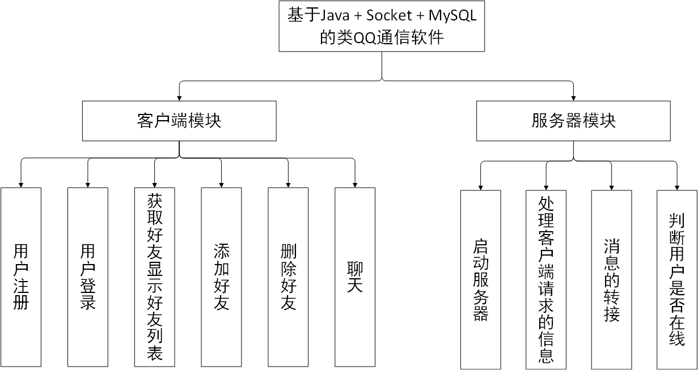
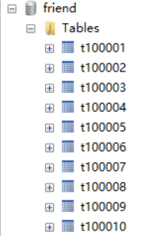
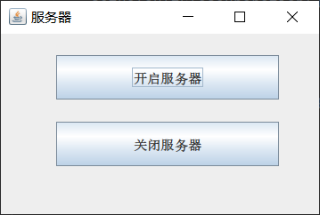
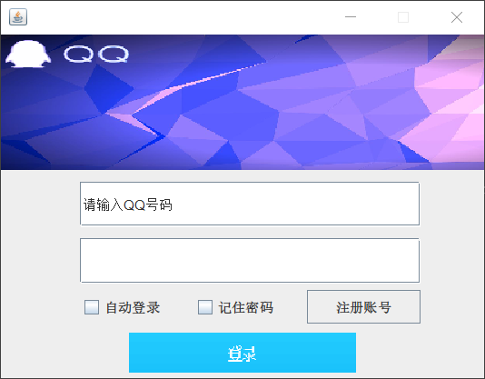
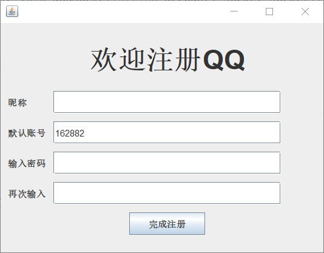
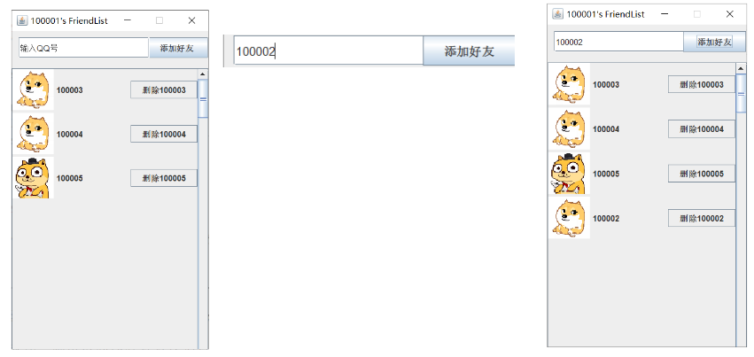
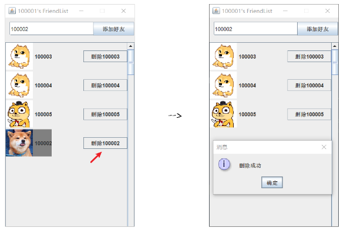
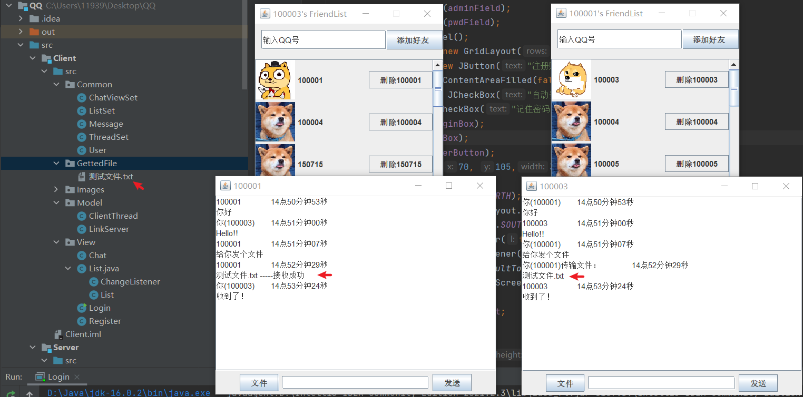
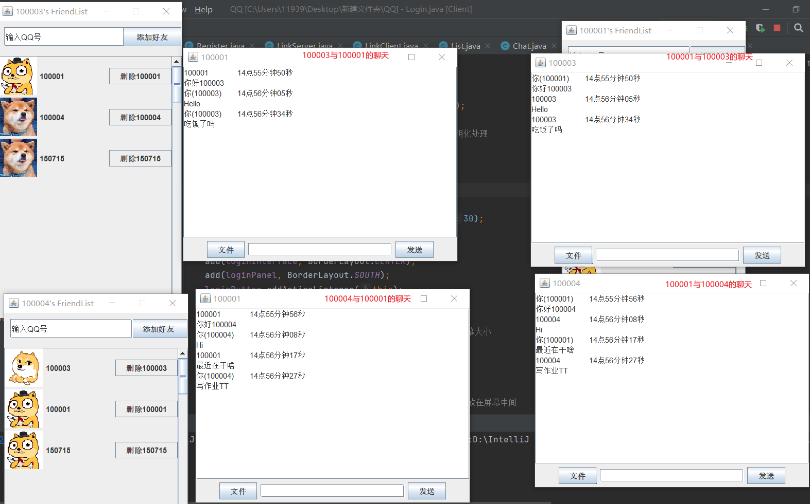

## 基于Java + Socket + MySQL 的类QQ通信软件

### 1.作品简介

本次作业实现的类QQ通信软件基于Java语言开发，使用Swing设计了UI界面，通过Socket实现通信，使用MySQL保存注册信息和好友信息，借助多线程实现服务器与客户端的连接。本次作业实现了以下基本功能：

- 用户注册：系统随机生成账号或用户自己指定账号，用户按要求填写相关信息。
- 用户登录：用户根据自己的账号和密码进行登录。
- 添加好友：输入好友账号，进行好友的添加。
- 删除好友：点击删除该好友按钮，进行好友的删除。
- 收发消息：登录成功后，双击好友打开聊天窗口进行好友聊天，对于聊天的内容拓展了文件的传送，并增加了好友不在线的提示。

   该类QQ通信软件的设计采用MVC结构，将视图View和操作Model放在了不同的包下，并分为客户端模块和服务器模块，详细功能如图所示。

### 2.数据库设计

该软件使用了两个数据库，第一个数据库为test，内含名为user的表，用来存放所有已注册用户的个人信息；另一个数据库叫friend，每个已注册用户在此数据库中均有一张表，表内含该用户所拥有的好友信息。

#### 	2.1注册用户信息表

| Field    | Type        | Comment            |
| -------- | ----------- | ------------------ |
| id       | INT(100)    | 用户在数据库中的id |
| account  | VARCHAR(20) | 账号               |
| name     | VARCHAR(20) | 昵称               |
| password | VARCHAR(20) | 密码               |

#### 	2.2好友信息表

| Field    | Type        | Comment            |
| -------- | ----------- | ------------------ |
| id       | INT(100)    | 用户在数据库中的id |
| account  | VARCHAR(20) | 账号               |
| password | VARCHAR(20) | 密码               |

### 3.模块设计

#### 	3.1 启动服务器

一开始最先点击开启服务器按钮，即可实例化LinkClient类用来循环监听用户的登录和注册请求，服务器管理界面如图2所示。

#### 	3.2 登录模块

登录模块的界面如图3所示。

点击登录按钮，首先判断账号和密码是否为空，然后封装为Message对象，向服务器发送数据，服务器通过与数据库进行比对来验证账号密码。

#### 	3.3 注册模块

注册模块的界面设计如图4所示，系统将自动为用户生成范围在100000~188888之间的账号，用户也可自行设置账号。

#### 	3.4 添加好友模块

添加好友的功能演示如图5所示：

#### 	3.5 删除好友模块

删除好友的功能演示如图6所示：

​                                                 										

#### 	3.6 聊天模块

聊天和文件传输功能:

一个用户与多个用户的聊天:

